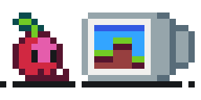
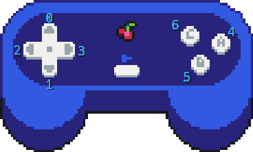

# CherryPop Manual
===
## Included libraries:
### The included libraries of CherryPop are  
- CherryPop's builtin functions (covered at syntax)  
- `math` (standard lua 5.1 math library)  
- `pairs` and `ipairs`
- `table ` 
- `string`  

if there are any missing functions, please let me know!


## Syntax:

### `_load() and _tick()`
these are the main functions which will be used in carts, `_load` is only  
ran once but  `_tick()` is ran every frame (60 fps), here is an example:
  
```lua
function _load()
    player={x=0,y=0}
end

function _tick()
    print("i am the player!",pl.x,pl.y)
end
```

### `poke(addr, value)`
sets the value of RAM at the given address
### `peek(addr)`
returns the value of a given memory address
### `color(hexColor)`  
converts a hex-formatted color value to rgb values so `#ffffff` is converted to `255,255,255`
### `pal(index,r,g,b)`
sets the color of a index (0-15) to an rgb value, this is paired well with `color(hexColor)`
### `cls(color)`
clears the screen to a specified color (0-15), this should be used before you draw things to the screen in `_tick()`
### `pset(x,y,color)`
sets a pixel color at a given position
### `pget(x,y)`
returns the pixel color at a given position
### `print(string,x,y,color)`
prints a string at a position
### `rect(x,y,width,height,color)`
draws a line rectangle at a position
### `rectfill(x,y,width,height,color)`
draws a filled rectangle at a position
### `circ(x,y,radius,color)`
draws a line circle
### `circfill(x,y,radius,color)`
draws a filled circle
### `sset(x,y,color)`
sets a color on the spritesheet (persistent even if you leave the game)
### `sget(x,y)`
returns the sprite color at a given coordinate on the spritesheet
### `sspr(sx,sy,sw,sh,x,y,transparentColor)`
draws a sized sprite at a sprite coordinate defined with sx and sy,  
the width and height of the sprite are defined with sw and sh (both are defined with pixel coords, not multiples of 8 like spr),
x and y are for where to draw the sprite, and transparentColor is for the transparency color used for the sprite (usually 0)
### `spr(ind,x,y,transparentColor,w,h)`
draws a sprite, ind is used for the indes of the sprite, x and y are for where the sprite is drawn,
and w/h are the width and height of the sprite (multiples of 8)
### `mset(x,y,tile)`
sets a tile on the tilemap at a given position
### `mget(x,y)`
returns the tile at a given position
### `map(mapStartX,mapStartY,mapStartWidth,mapStartHeight,drawX,drawY,transparentColor)`
draws the map (the names of the arguments explain most of it and im too lazy to write an explanation :P)
### `camera(x,y)`
sets the camera position (flooring your x and y values are reccomended)  
  
  
  
### `btn(i)`
returns the input that is down (can be held)

### `btnp(i)`
returns the input that was pressed (once)  

## The Menu
NOTE: the ui will be changed in a future update!
